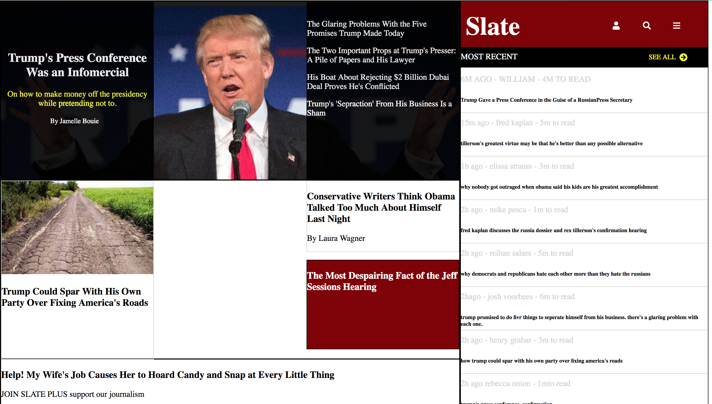

# Slate Replica
Copy of a Slate webpage

**Link to project:** http://recruiters-love-seeing-live-demos.com/

## How It's Made:

**Tech used:** HTML, CSS, JavaScript, Framework of choice

Used HTML and CSS to make a replica Slate web page.

## Optimizations

I came back and tweaked this page after I had discovered a breakthrough with CSS and spacing.

## Lessons Learned:

This project furthered my understanding of CSS and spacing.

## Examples:
Take a look at these couple examples that I have in my own portfolio:

**Palettable:** https://github.com/alecortega/palettable

**Twitter Battle:** https://github.com/alecortega/twitter-battle

**Patch Panel:** https://github.com/alecortega/patch-panel
